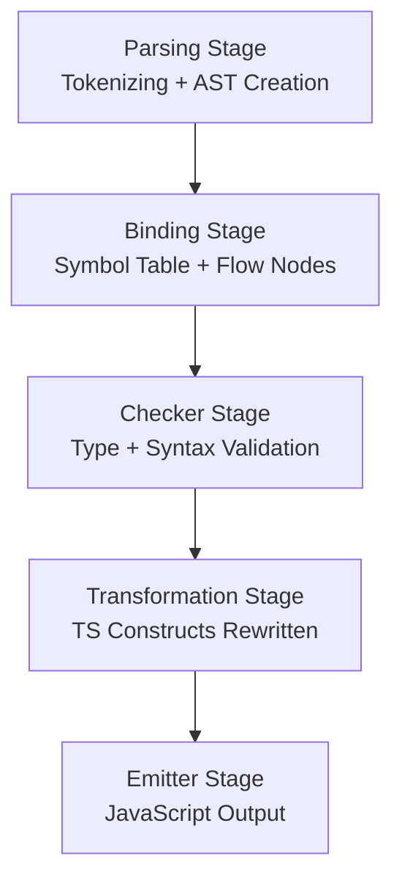

# TypeScript Compilation and History

## 📖 Introduction
TypeScript is a **superset of JavaScript** that adds optional static typing, interfaces, and other advanced features. It was designed to make large-scale JavaScript applications easier to build and maintain. Ultimately, TypeScript code is always converted into plain JavaScript so it can run in browsers or Node.js.

---

## 🔎 Internal Conversion Process
TypeScript is internally converted into JavaScript through a process called **transpilation**, handled by the TypeScript compiler (`tsc`). The compilation pipeline consists of several stages:

### 1. Parsing Stage (Lexical & Syntactic Analysis)
- The compiler reads the `.ts` file and breaks it into tokens (keywords, identifiers, operators).  
- It builds an **Abstract Syntax Tree (AST)**, representing the logical structure of the code.  

### 2. Binding Stage (Symbol Table Generation)
- The compiler creates a **symbol table** that maps identifiers (variables, functions, classes) to their definitions.  
- This stage also records **data types** associated with each symbol and saves them into symbol table.  
- **Flow nodes** are generated to represent control flow (loops, conditionals statements, branches).  
- **Parent nodes** are linked to child nodes, establishing hierarchical relationships in the AST.  
- This stage ensures that references to variables and functions are correctly bound to their declarations.  

### 3. Checker Stage (Type & Syntax Validation) (Checks for 2 times)
- The **checker** validates the correctness of the program:  
  - Ensures that **data types match** (e.g., no assigning a string to a number).  
  - Performs **syntax checking** to catch invalid constructs.  
  - Handles **short-circuit checks** (logical operators like `&&` and `||`) to ensure type safety in conditional flows.  
- If errors are found, they are reported here before code emission.  

### 4. Transformation Stage
- TypeScript-specific constructs are removed or rewritten:  
  - **Types, interfaces, enums, generics** → stripped out.  
  - **Classes** → rewritten into ES5 prototypes or ES6 classes depending on target.  
  - **Async/await** → transformed into generator functions with helpers if targeting older JS.  
  - **Modules** → rewritten into CommonJS, AMD, or ES Modules depending on configuration.  

### 5. Emitter Stage (Code Generation)
- The compiler generates the final **JavaScript (`.js`) files**.  
- It also optionally produces **declaration files (`.d.ts`)** containing type definitions.  
- During emission, all unnecessary TypeScript-only constructs (types, annotations, interfaces) are stripped away.  
- The output is clean, executable JavaScript that can run in any environment.  

---

## ⚙️ Example Conversion
```typescript
// TypeScript
function greet(name: string): string {
  return "Hello, " + name;
}
```

After transpilation (targeting ES5):

```javascript
// JavaScript
function greet(name) {
  return "Hello, " + name;
}
```

➡️ Notice how the **`: string` type annotations disappear** — they were only used for type-checking.

---

## 📌 Key Takeaways
- **TypeScript doesn’t run directly**; it must be transpiled into JavaScript.  
- **Types are erased** during compilation — they exist only at development time.  
- The pipeline includes **Parsing → Binding → Checker → Transformation → Emission**.  
- The compiler ensures **early error detection**, but the final output is always **valid JavaScript**.  
- TypeScript is a **developer productivity tool**, not a runtime replacement for JavaScript.  

---

## 🪄 TypeScript Compilation Pipeline — Flowchart


---

## 🚀 Installation
```bash
# Install TypeScript globally
npm install -g typescript

# Or install locally for a project
npm install typescript --save-dev
```

---

## 🧪 Usage
### Compile a single TypeScript file
```bash
tsc file.ts
```

### Compile an entire project (using tsconfig.json)
```bash
tsc
```

### Watch mode (auto-compilation)
```bash
tsc --watch
```

---
